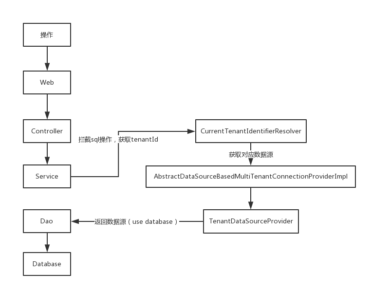

##SpringBoot + Hibernate实现多租户

###参考自:
 
(代码)https://www.ramostear.com/articles/spring_boot_building_multitenancy_app.html

（租户原理） https://www.jianshu.com/p/2274488225af

#### 原理

**真如前面所说，Hibernate实现多租户的原理实际上就是在调用具体sql语句
之前先调用一句user database来切换数据库，实现切换租户空间的功能，所以Hibernate提供了两个类来
帮助我们在框架层面拦截我们要执行的sql语句，并注入切换数据库的操作，操作流程**

**测试步骤：**

- 执行res中的db脚本文件初始化数据库
- 在浏览器中输入
- http://localhost:8080/login.html   进入登陆页面
- 填参数

**失败case1**
- 租户ID :  evan_tenant
- 用户名: evan
- 密码:  222222

**失败case2**
- 租户ID :  messi_tenant
- 用户名: evan
- 密码:  111111

**成功case3**
- 租户ID :  evan_tenant
- 用户名: evan
- 密码:  111111

**成功case4**
- 租户ID :  messi_tenant
- 用户名: messi
- 密码:  222222 

